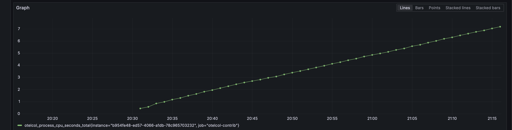

# OpenTelemetry with .NET

The tiniest example I could think of. Good as template.

## Run

```shell
docker compose up
dotnet run --project Tel.Web
```

Grafana will be available (after a short while) on `localhost:40300`. Use `admin` as username and password. You can use [JetBrains HTTP Client](https://www.jetbrains.com/help/idea/http-client-in-product-code-editor.html) to simulate traffic by running the call defined in `Tel.Web.http`.

## Features

- `Microsoft.Extensions.Logging` based logging without clutter on `stdout`
- Application startup logging. Before initializing OpenTelemetry
- [`OTEL_DIAGNOSTICS.json`](https://github.com/open-telemetry/opentelemetry-dotnet/blob/main/src/OpenTelemetry/README.md#self-diagnostics) file included
- ASP .NET Instrumentation plus custom explicit tracing
- [Grafana LGTM](https://github.com/grafana/docker-otel-lgtm) included as observability platform
- [OpenTelemetry Collector Contrib.](https://github.com/open-telemetry/opentelemetry-collector-contrib) with configuration and self-monitoring included
- ASP .NET minimal APIs
- Source code commentary with links to reading resources
- _TODO_ Exemplars
- _TODO_ Samplers

## Pictures

_Human readable logs on `stdout`_


_Application traces_


_Application logs_


_Application metrics_


_OpenTelemetry Collector metrics_



## Side notes

**Do not use plain HTTP in production, is too slow. Use gRPC when possible**

**There are two OpenTelemetry Collectors: one from Grafana LGTM and one configured explicity. This setup is whack, good for demonstration purposes only. In production, use one OpenTelemetry Collector**

### Seemingly double metrics

You will see a job named `opentelemetry-collector` in Prometheus metrics. This exists because:
> By default, the Collector generates basic metrics about itself and exposes them using the OpenTelemetry Go Prometheus exporter for scraping at http://127.0.0.1:8888/metrics. [See here for mor information on default metrics](https://opentelemetry.io/docs/collector/internal-telemetry/#configure-internal-metrics)

The Grafana LGTM distribution used in this example sets up scraping on `localhost:8888` by default. [See here the Grafana LGTM OpenTelemetry Collector configuration](https://github.com/grafana/docker-otel-lgtm/blob/b2bc9f79fab0b3eb6b9fa18ac817d8f1983c058d/docker/otelcol-config.yaml#L13). The metrics for the OpenTelemetry Collector used within this example are under job name `otelcol-contrib`.

### OpenTelemetry Configuration Schema

To better understand how OpenTelemetry `service` stanza can be configured browse the [Go source code type definitions here](https://pkg.go.dev/go.opentelemetry.io/collector/service#Config).

### OTEL_DIAGNOSTICS.json

Configures self-diagnostic for OpenTelemetry .NET SDK, the file is supposed to be full of `NUL` because it is pre-allocated. [See here for further details](https://github.com/open-telemetry/opentelemetry-dotnet/blob/main/src/OpenTelemetry/README.md#self-diagnostics)

### How do I change the labels that Loki assigns to my OTLP logs ?

[See the official Loki documentation](https://grafana.com/docs/loki/latest/send-data/otel/#changing-the-default-mapping-of-otlp-to-loki-format)

### Do I have the same concept for labels in Tempo, like Loki ?

No.